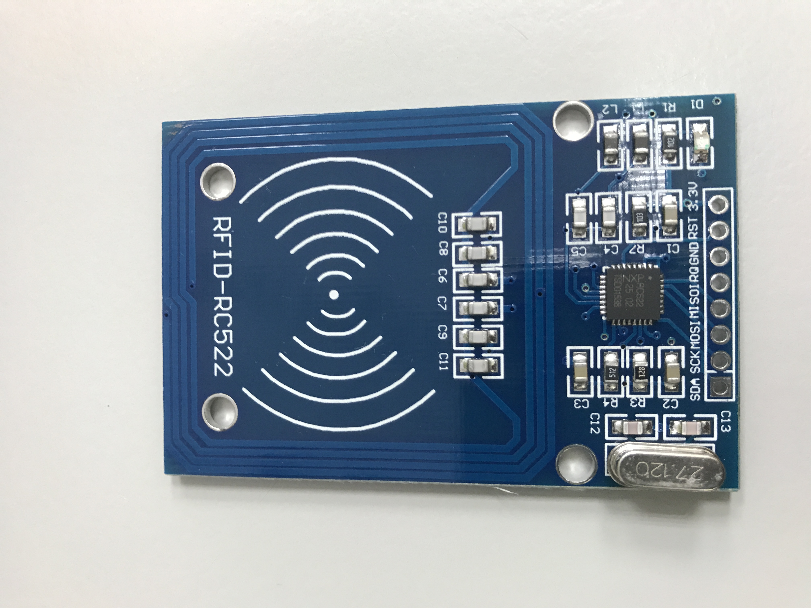
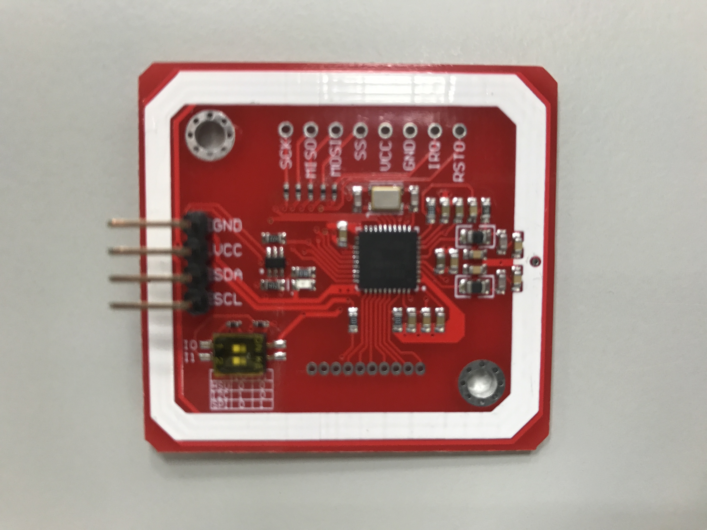

# Attendance Tracker System

This is a open source project which can be used to attendance tracker system. We use the low cost RFID device that you can buy it from [Taobao](https://world.taobao.com/), [Amazon](https://www.amazon.com/) or other shopping service. Now we used the MFRC522 or PN532 controller board and based on [Arduino](https://www.arduino.cc/) or [Raspberry Pi](https://www.raspberrypi.org/).

## Hardware

MFRC522

PN532

## Typical pinouts for MFRC522

| Signal    | MFRC522      | Arduino Pro Micro | Raspberry Pi 3            |
| --------- | ------------ | ----------------- | ------------------------- |
| SPI SS    | `SDA`        | `10`              | `24` `SPI0 CE0` `GPIO8`   |
| SPI SCK   | `SCK`        | `15`              | `23` `SPI0 SCLK` `GPIO11` |
| SPI MOSI  | `MOSI`       | `16`              | `19` `SPI0 MOSI` `GPIO10` |
| SPI MISO  | `MISO`       | `14`              | `21` `SPI0MISO` `GPIO9`   |
|           | `IRQ`        |                   |                           |
|           | `GND`        | `GND`             | `GND`                     |
| RST/Reset | `RST`        | `RST`             | `22` `GPIO25`             |
|           | `VCC` `3.3V` | `VCC` `3.3V`      | `1` `3.3V`                |

## Typical pinouts for PN532

| Signal  | PN532 | Arduino Pro Micro | Raspberry Pi 3 |
| ------- | ----- | ----------------- | -------------- |
|         | `GND` |                   |                |
|         | `VCC` |                   |                |
| HSU TXD | `SDA` | `0` `RX`          |                |
| HSU RXD | `SCL` | `1` `TX`          |                |

## Switch setting for PN532

| Interface             | Channel 1 | Channel 2 |
| --------------------- | --------- | --------- |
| HSU (High Speed UART) | `OFF`     | `OFF`     |
| I2C                   | `ON`      | `OFF`     |
| SPI                   | `OFF`     | `ON`      |

> Reference
>
> [User Guide](https://www.elechouse.com/elechouse/images/product/PN532%20NFC%20Module/PN532%20NFC%20RFID%20Module%20Manual.pdf)
>
> [Schematic in PDF](https://www.elechouse.com/elechouse/images/product/PN532%20NFC%20Module/NFC_EASY_SHIELD_V2.0.pdf)